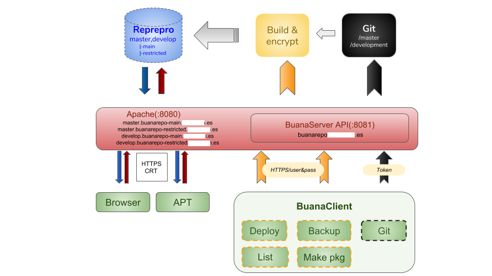

BuanaServer
###########

.. image:: docs/images/buanarepo.png

Overview
********

BuanaServer is a API tools set that synchronize and builds .deb packages (from local directories or git). In addition, BuanaServer allows orchestrating servers. Use Buanaclient CLI (https://github.com/nebul4ck/buanaclient.git) in order to launch commands.

BuanaServer API
===============

* **BuanaServer API** with SSL/TLS + BasicAuth (User/Pass)

Install
=======

1. Clone this repository

.. code:: console

  $ git clone https://github.com/nebul4ck/buanaserver.git
..

2. build a debian package

.. code:: console

  $ cd buanaserver
  $ dpkg -b buanaserver/ buanaserver-1.4.7.deb
..

3. Install debian package
  
.. code:: console

  $ sudo apt install ./buanaserver-1.4.7.deb
..

Third-party components
======================

* **Reprepro** + GPG Signed Packages
* **Apache2** with mod_wsgi, user&pass login, User Certificate and SSL/TLS.

API's Endpoints
===============

List available packages
-----------------------

.. image:: docs/images/list.png

Build from git repository
-------------------------

Backup third-party services
---------------------------

.. image:: docs/images/backup.png

Make a package from either jenkins' source or buanarepo's source
----------------------------------------------------------------

Deploy and orchestration
------------------------

Build, encription and upload to repository
==========================================

Buanaserver call to buanarepo script (/usr/bin/buanarepo) and it **build**, **encript** and **upload** the DEBIAN package to reprepro (repository):

Trace:

**Environment**

i.e. with python package

.. code:: console

  LANGUAGE: python, node, django or none
  BRANCH: master or develop
  BUILDER: /var/lib/jenkins/workspace/<repository>/<pkg_name>  (pkg_name = repository)
  BASEDEB: /srv/buanarepo-debs
  BASE_ENCRYPT: /srv/buanarepo-debs/encrypt
  APPNAME_CONV: <pkg_name> (assets-manager = assets_manager)
  DIRECTORY_TO_ENCRYPT: /srv/buanarepo-debs/encrypt/<repository>/usr/lib/python2.7/dist-packages/${APPNAME_CONV}/
  APP_MAIN_DEB: /srv/buanarepo-debs/<pkg_name>_1.4.12.deb
  APP_ENCRYPT_DEB: /srv/buanarepo-debs/encrypt/<pkg_name>_1.4.12.deb
  OLD_RELEASE: /srv/buanarepo-debs/oldRelease
  OLD_ENCRYPT_RELEASE: /srv/buanarepo-debs/encrypt/oldRelease
  URL_UBUNTU: /srv/buanarepo-repo/ubuntu/${BRANCH}
  APP_WITH_VERSION: <pkg_name>_1.4.12
  APP_MAIN_DEB: /srv/buanarepo-debs/<pkg_name>_1.4.12.deb
..

i.e. with buanaclient package (https://github.com/nebul4ck/buanaclient):

**PLAIN CODE**

1. Copy from builder to base_deb:

.. code:: console

  cp -r /var/lib/jenkins/workspace/buanaclient/buanaclient /srv/buanarepo-debs
..

2. Set root owner to base_deb/appname:

.. code:: console

  chown -R root:root /srv/buanarepo-debs/buanaclient
..

3. Build in plain mode: dpkg-deb: building package 'buanaclient' from /srv/buanarepo-debs/buanaclient '/srv/buanarepo-debs/buanaclient_1.4.12.deb'.

4. Delete tmp dir base_deb/appname:

.. code:: console

  rm -rf  /srv/buanarepo-debs/buanaclient
..

**ENCRYPTION CODE**

5. Copy from builder to base_encrypt:

.. code:: console

  cp -r /var/lib/jenkins/workspace/buanaclient/buanaclient /srv/buanarepo-debs/encrypt
..

6. Set root owner to base_encrypt/appname: 

.. code:: console

  chown -R root:root /srv/buanarepo-debs/encrypt/buanaclient
..

7. Encrypting the code (directory_to_encrypt): 

.. code:: console

  pyconcrete [options] /srv/buanarepo-debs/encrypt/buanaclient/usr/lib/python2.7/dist-packages/buanaclient/
..

8. Build encrypted code: building package 'buanaclient' from /srv/buanarepo-debs/encrypt/buanaclient to '/srv/buanarepo-debs/encrypt/buanaclient_1.4.12.deb'

9. Delete tmp dir base_encrypt/appname:

.. code:: console

  rm -rf  /srv/buanarepo-debs/encrypt/buanaclient
..

**UPLOADING PACKAGES**

10. Uploading plain code:

* COMPONENT: main
* ARCH: amd64
* DIST: xenial
* APP_DEB: /srv/buanarepo-debs/buanaclient_1.4.12.deb

11. Uploading encripted code:

* COMPONENT: restricted
* ARCH: amd64
* DIST: xenial
* APP_DEB: /srv/buanarepo-debs/encrypt/buanaclient_1.4.12.deb
