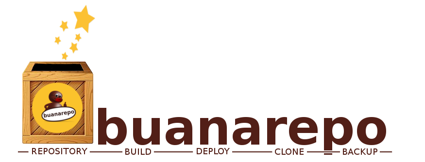

BuanaServer
###########

Buanaserver is a tools set that synchronize and builds .deb packages (from local directories or git). In addition, Buanaserver allows orchestrating servers.

**Buanaserver API**

* **Buanaserver API** + SSL/TLS + 

**Third-party components**

* **Reprepro** + GPG Signed Packages
* **Apache2** + mod_wsgi + BasicAuth (User/Pass) + SSL/TLS + Certificate-based authentication.